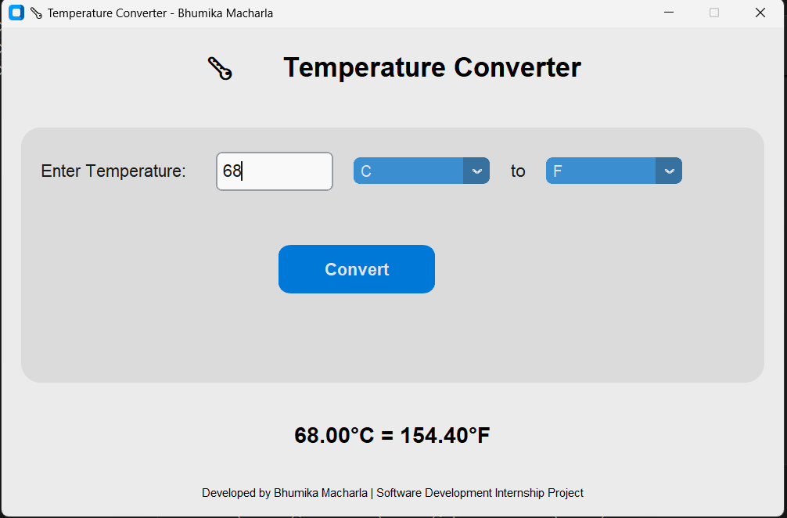

# 🌡️ Temperature Converter (Python GUI)

**A modern Temperature Converter app built with Python and Tkinter — converts between Celsius, Fahrenheit, and Kelvin with a clean modular design.**


---

## 🧭 Project Overview  
This project is a **Temperature Converter GUI application** developed in Python.  
It allows users to convert temperature values between **Celsius (°C)**, **Fahrenheit (°F)**, and **Kelvin (K)**.  
The app uses a simple and interactive interface built with Tkinter and demonstrates modular Python programming principles.

---

## ✅ Features  
- 🌡️ Convert temperatures between Celsius, Fahrenheit, and Kelvin  
- 🖥️ User-friendly GUI interface built with Tkinter  
- ⚙️ Modular design — logic and UI separated into different files  
- 🚫 Error handling for invalid inputs  
- 💾 Lightweight — no heavy dependencies required  
- 🧠 Clean, well-structured, and beginner-friendly code  

---


## ⚙️ Installation & Run  

### 🧩 Prerequisites  
Make sure you have **Python 3.8+** installed on your system.  
You can verify it by running:  
```bash
python --version
```

---

### 🪜 Steps to Run  

1. **Clone this repository**  
   ```bash
   git clone https://github.com/Bhumika611/Temperature-Converter.git
   cd Temperature-Converter
   ```

2. **(Optional) Install dependencies**  
   If you use `customtkinter` for styling:  
   ```bash
   pip install customtkinter
   ```

3. **Run the application**  
   ```bash
   python main.py
   ```

---

## 🎬 Usage  
1. Open the app window.  
2. Enter a temperature value in the input box.  
3. Choose the **From** and **To** temperature units.  
4. Click the **Convert** button.  
5. Instantly view the converted temperature below.  

---

## 📸 Screenshots 

<p align="center">
  
</p>

---

## 🧰 Tech Stack  

Language | Python 3.8+ 
GUI Framework | Tkinter 
Design Style | Modular Programming 
Version Control | Git & GitHub 

---

## 🚀 Future Improvements  
- 🌙 Add **Dark/Light Mode** toggle  
- 🧾 Show **conversion history**  
- 🎨 Add **custom themes and animations**  
- ⌨️ Keyboard shortcut support  
- 🧊 Add more temperature scales like **Rankine** or **Réaumur**  
- 📦 Create a **standalone executable (.exe)** for Windows  

---

## 📄 License  
This project is licensed under the **MIT License**.  
You are free to use, modify and distribute this project under the terms of the license.  

---

## 👩‍💻 About the Developer  

**👋 Hi, I'm [Bhumika Macharla](https://github.com/Bhumika611)**  
A passionate developer who loves combining **logic and creativity** to build meaningful software solutions.  
Currently exploring **Software Development**, **Python**, and **AI-based applications**.

📫 **Connect with me:**  
- 🌐 GitHub: [Bhumika611](https://github.com/Bhumika611)  
- 💼 LinkedIn: (https://www.linkedin.com/in/macharla-bhumika-4232922a4/)
- ✉️ Email: bhumikamacharla@gmail.com

---

⭐ *If you like this project, don’t forget to give it a star on GitHub!* ⭐

